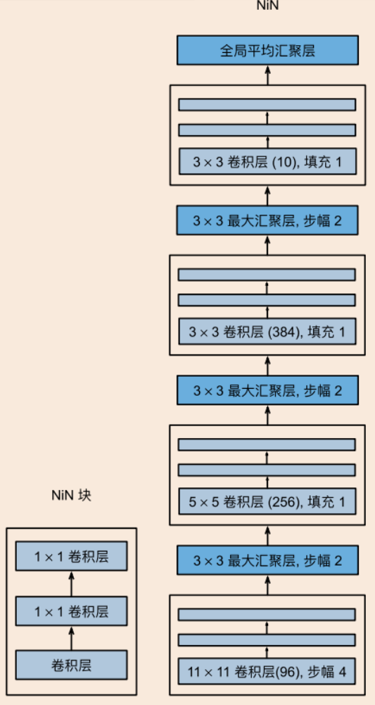
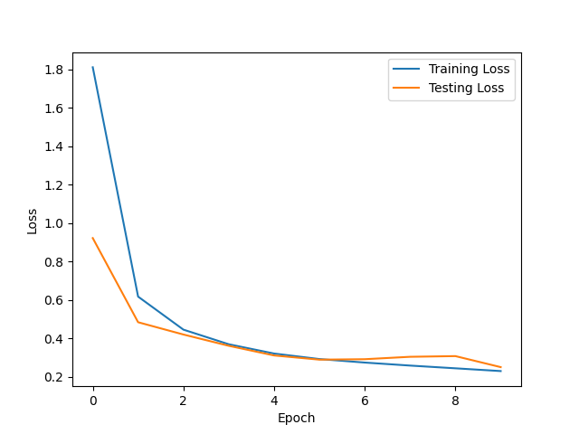

# Nin网络的简单应用

## 任务：

对简单的数据集上进行nin网络模型的应用：对mnist数据集进行手写数字识别

## NiN模型特点:

  NiN放弃了使用全连接层，而是使用两个1x1卷积层将空间维度中的每个像素视为单个样本，将通道维度视为不同特征(由于任务较为简单，该项目nin模块只使用一次1*1卷积核）。相当于在每个像素的通道上分别使用多层感知机。
  优点:NiN去除了全连接层，可以减少过拟合，同时显著减少NiN的参数数量

## 训练过程：

* 总体上，损失随时间而减低，且拟合效果较好，甚至在第十轮的测试数据集达到了99%以上
* 存在曲线上升的情况：损失上升可能意味着模型在训练过程中出现了过拟合、学习率设置不当、数据质量问题或其他训练策略上的问题。但是因为测试的准确率较高，拟合具有一定的泛化能力。，

## note：

虽然该模型在mnist数据集上表现良好，不过这仅限于和mnist数据相似的数据。在几次使用手写的数字的识别中，模型的识别差强人意。换句话说：数据集表现得过于单一。
